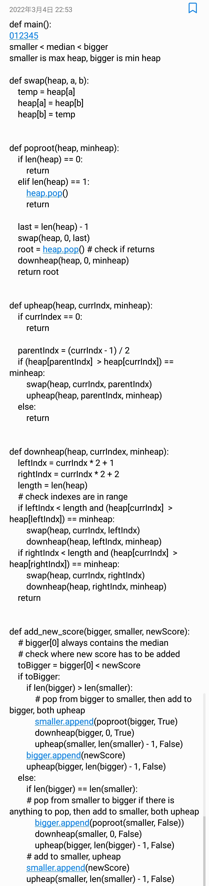

# Chunks
2022-03-05

## Part 2
Was thinking of tracking the median while new scores were added, and thought of making
two separate priority queues to track the numbers bigger and smaller than the median.\
Never did that before so wanted to try it out.

  

    I wrote out the double heap median tracking code in my note-taking app
    on my phone while on the train, here is a screenshot of it:
  

  Some more severe errors (compared to misspelling a parameter name and missing a bracket)
  that were in here:
  - `heap.pop()` in `poproot` doesn't return the popped element causing `None` to be added
into heaps
  - `parentIndx = (currIndx - 1) / 2` returns a float because **Python**
  - `toBigger = bigger[0] < newScore` crashes at the start because `bigger` is empty
  - Labeled some `True`/`False` arguments incorrectly for smaller/bigger max/min heaps

  

I can say that I am one of the cool kids who write code in plain text on Notepad
now.
